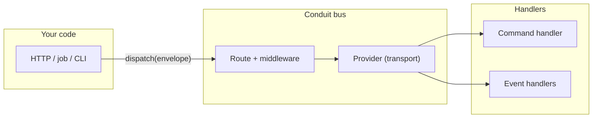
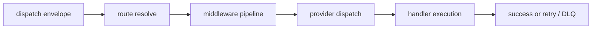
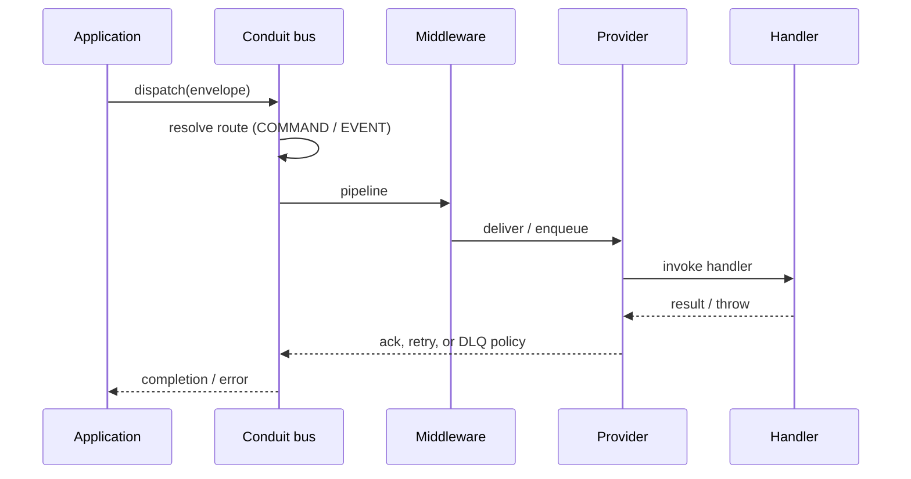
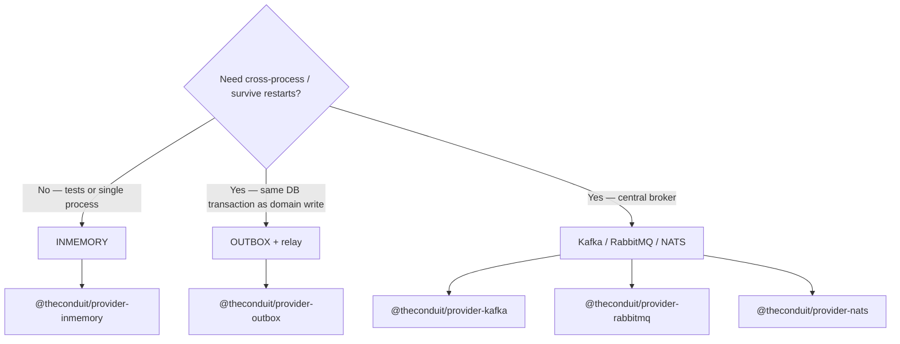
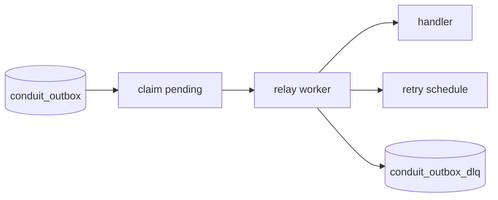

# How Conduit works

Read this page once, then follow [Getting started](getting-started) to type the same flow in code. The same flows are also stored as Mermaid sources under `docs/architecture/diagrams/` in the repository for review in git.

## Mental model: commands and events

Conduit routes **operation names** (for example `order.create`, `order.created`) to handlers. You declare whether an operation is a **COMMAND** (work to do, usually one logical consumer) or an **EVENT** (something happened; many subscribers may react).

Delivery is **at-least-once**: retries and duplicates are normal; handlers should be **idempotent** where it matters (see [Idempotency](idempotency-patterns)).

## One message’s path

From `dispatch` to a handler, Conduit resolves the route, runs middleware, asks the **provider** to deliver, then executes your handler. Failures can trigger retries or DLQ according to the route.

### Sequence view

For **in-memory**, “provider dispatch” is immediate. For **brokers** or **outbox**, the same logical steps apply; the provider may persist or publish before your handler runs on a worker.

## Choosing a transport (high level)

Match **environment** and **durability** needs first; keep handlers and routes stable when you swap providers.

Details and trade-offs: [Choosing a transport](choosing-provider).

## Transactional outbox (when you use OUTBOX)

The app writes to **`conduit_outbox`** in the same transaction as your domain data. A **relay** process claims work and drives delivery (retries, DLQ). Your handlers still look like ordinary Conduit handlers.

Deep dive: [Transactional outbox](outbox-provider) and [SQL outbox package](../packages/provider-outbox).

## Where to go next

| Step | Doc |
| --- | --- |
| Install and first `dispatch` | [Getting started](getting-started) |
| Pick Kafka vs SQL vs in-memory | [Choosing a transport](choosing-provider) |
| Package map | [Overview](../packages/) |
