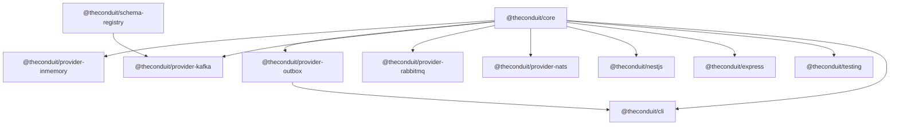

# Overview

Conduit ships as scoped npm packages **`@theconduit/*`**. Each published package is **ESM-only** (`"type": "module"`), ships **TypeScript** types from `dist/`, and uses **`"sideEffects": false"`** where applicable.

## When to read what

| Goal | Start here |
| --- | --- |
| Understand the flow (diagrams) | [How Conduit works](../guides/how-conduit-works) |
| First bus and dispatch | [Getting started](../guides/getting-started) |
| Pick a transport | [Choosing a transport](../guides/choosing-provider) |
| Durable SQL queue | [Transactional outbox](../guides/outbox-provider) → [SQL outbox package](./provider-outbox) |
| Kafka / schemas | [Kafka transport](./provider-kafka) → [Schema registry](./schema-registry) |
| HTTP + trace | [Express](./express) or [NestJS](./nestjs) |

## Dependency graph (conceptual)

## Published packages

| Topic | npm package | Role |
| --- | --- | --- |
| Core | `@theconduit/core` | Bus, routing, envelopes, middleware, retries, DLQ contracts |
| In-process | `@theconduit/provider-inmemory` | Local / tests without brokers |
| Outbox | `@theconduit/provider-outbox` | SQL transactional outbox + relay |
| Kafka | `@theconduit/provider-kafka` | KafkaJS transport |
| RabbitMQ | `@theconduit/provider-rabbitmq` | AMQP transport |
| NATS | `@theconduit/provider-nats` | Core NATS + JetStream |
| Schemas | `@theconduit/schema-registry` | Registry + Avro/JSON validation |
| Nest | `@theconduit/nestjs` | Nest wiring + decorators |
| Express | `@theconduit/express` | Express middleware + trace |
| Tests | `@theconduit/testing` | Fakes and matchers |
| Ops | `@theconduit/cli` | `conduit` CLI |

Internal tooling under `tools/*` is not published.

## Versioning

Keep **`@theconduit/*`** versions aligned in apps (see [Versioning & schemas](../guides/versioning-guide)).
